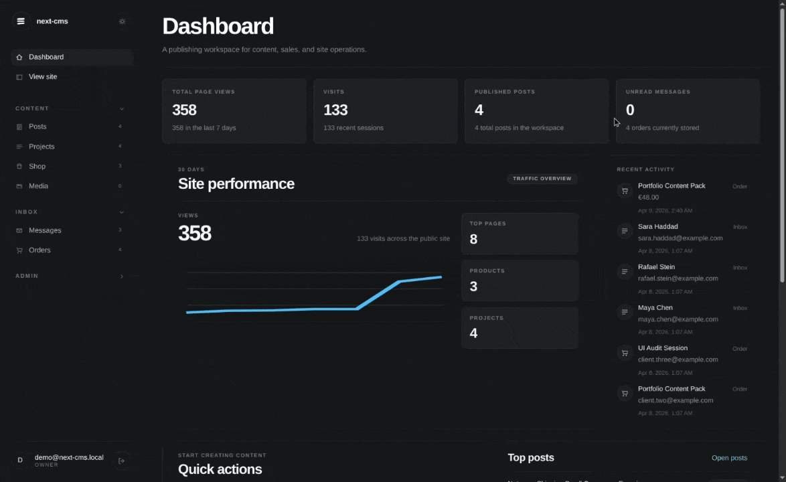

# next-cms

A reusable Next.js CMS starter extracted from the portfolio/admin system and cleaned up for future client and studio projects.



## Demo

- site: `https://next-cms-demo-six.vercel.app`
- admin: `https://next-cms-demo-six.vercel.app/admin/login`
- email: `demo@next-cms.demo`
- password: `next-cms.demoXu678!`

## Included modules

- posts / blog
- projects / work
- shop / digital products and services
- contact inbox
- analytics
- role-based admin users

## Admin model

The starter supports multiple admin users with roles:

- `OWNER`
- `ADMIN`
- `EDITOR`

The first account created through `/admin/login` becomes the initial `OWNER`.

## Module toggles

From admin settings you can enable or disable:

- blog
- projects
- shop
- analytics tracking

Disabled modules are hidden from public navigation and their public routes return `404`.

## Development

```bash
npm install
npx prisma migrate dev --name init
npm run dev
```

To load demo content:

```bash
npm run db:seed-dummy
```

## Deployment

This starter is designed to deploy cleanly on Vercel with Neon Postgres.

Before the first production deployment:

```bash
npx prisma migrate deploy
```

## Notes

- this starter uses Prisma ORM with PostgreSQL
- on Neon, use the `-pooler` hostname for `DATABASE_URL`
- keep the direct Neon hostname in `DIRECT_URL` for Prisma migrations and CLI commands
- if you later enable Prisma Accelerate, set `DATABASE_URL` to the `prisma://` URL and keep the direct Postgres URL in `DIRECT_URL`
- uploaded files are served through `/uploads/...`
- PayPal is optional and only needed when the shop module is enabled
